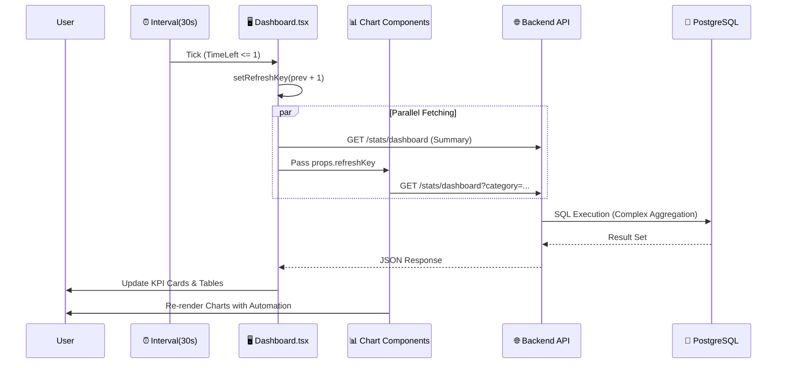

# 📊 SafeGuard Dashboard: Enterprise Developer Guide
> **"Operational Intelligence for Civil Service Management"**

본 문서는 **SafeGuard 관리자 대시보드**의 아키텍처, 비즈니스 로직, 상태 관리 전략, 디자인 시스템 및 API 명세를 집대성한 기술 문서입니다.  
실무 대기업 프로젝트 표준(Enterprise Standard)에 준하여 작성되었으며, 신규 개발자 온보딩 및 유지보수의 **Single Source of Truth** 역할을 수행합니다.

---

## 0. 문서 통제 정보 (Document Control)

| 항목 | 내용 |
| :--- | :--- |
| **문서 ID** | SG-DOC-DASH-001 |
| **기능명** | SafeGuard Integrated Admin Dashboard |
| **시스템명** | SafeGuard Front-Office System |
| **작성자** | SafeGuard Dev Team |
| **검토자** | Senior Architect |
| **문서 상태** | **[Approved]** (v2.0 - Code Sync Complete) |
| **최종 수정** | 2026-01-17 |

---

---

## 1. 시스템 개요 (System Overview)

SafeGuard 대시보드는 민원 접수부터 처리 완료까지의 전 과정을 **실시간(Near Real-time)**으로 관제하는 중앙 통제 시스템입니다. 
단순한 데이터 조회를 넘어, **병목 구간 식별**, **SLA(서비스 수준 협약) 준수 여부 모니터링**, **예측적 트렌드 분석**을 통해 데이터 기반 의사결정을 지원합니다.

### 1.1 핵심 가치 (Key Value Props)
-   **Real-time Observability**: 30초 주기 자동 갱신(Auto-refresh)으로 현장 상황을 즉시 반영.
-   **Insight-Driven**: 단순 통계가 아닌, '전월 대비 증감율', '처리 지연율' 등 가공된 인사이트 제공.
-   **Interactive UX**: 필터링(Filter), 드릴다운(Drill-down), 툴팁(Tooltip)을 통한 입체적 데이터 탐색.

---

## 2. 아키텍처 및 컴포넌트 구조 (Architecture)

### 2.1 컴포넌트 계층도 (Hierarchy)
대시보드는 `단방향 데이터 흐름(Uni-directional Data Flow)` 원칙을 따르며, 상위 컨테이너가 상태를 제어합니다.

```mermaid
graph TD
    Root[Dashboard Page] -->|Control| Header[Header & Filters]
    Root -->|Data| KPI[KPI Grid Section]
    Root -->|refreshKey| ChartZone[Main Chart Zone]
    Root -->|refreshKey| Bottleneck[Bottleneck Analysis]
    Root -->|Data| OverdueList[Overdue Complaint Table]

    subgraph "Chart Zone"
        ChartZone --> CatChart[ComplaintCategoryChart<br/>(Donut)]
        ChartZone --> TrendChart[ComplaintTrendChart<br/>(Line + Area)]
        ChartZone --> GrowthChart[ComplaintGrowthTrendChart<br/>(Mixed Column)]
    end

    subgraph "Bottleneck Zone"
        Bottleneck --> UnproChart[DistrictBottleneckChart<br/>(Horizontal Bar: Blue)]
        Bottleneck --> OverdueChart[DistrictBottleneckChart<br/>(Horizontal Bar: Red)]
    end
```

### 2.2 폴더 및 파일 구조 (Directory Structure)
```bash
frontend/src/
├── pages/
│   └── Dashboard.tsx               # [Container] 상태 관리, API 호출, 레이아웃 오케스트레이션
└── components/
    └── Charts/
        ├── ComplaintCategoryChart.tsx    # [Donut] 분야별 비중 및 리스트
        ├── ComplaintTrendChart.tsx       # [Line] SLA 준수율 및 미처리 잔량 분석
        ├── ComplaintGrowthTrendChart.tsx # [Mixed] 기간별 접수량 및 증감율(YoY/MoM)
        └── DistrictBottleneckChart.tsx   # [Bar] 자치구별 병목/지연 현황 (Horizontal)
```

---

## 2.3 시스템 요구사항 (System Requirements)

### 기능 요구사항 (Functional Requirements)
| ID | 요구사항 내용 | 중요도 | 비고 |
| :--- | :--- | :--- | :--- |
| **FR-DASH-01** | 대시보드는 30초 주기로 최신 데이터를 자동 갱신해야 한다. | **Must** | `setInterval` 구현 |
| **FR-DASH-02** | SLA 준수율, 미처리 잔량 등 KPI 지표를 실시간 계산하여 표시해야 한다. | **Must** | SQL 집계 |
| **FR-DASH-03** | 발생 후 3일이 경과한 미처리 민원은 'Overdue'로 시각적 경고(Red)를 주어야 한다. | **Must** | `animate-pulse` |
| **FR-DASH-04** | 사용자는 카테고리(교통/안전 등) 및 기간(일/월/년)별로 데이터를 필터링할 수 있어야 한다. | **Should** | Query Param |

### 비기능 요구사항 (Non-Functional Requirements)
| 항목 | 기준 | 설명 |
| :--- | :--- | :--- |
| **성능 (Latency)** | **< 100ms** | 대시보드 진입 시 FCP(First Contentful Paint) 기준 |
| **데이터 정합성** | **100%** | DB 데이터와 차트 시각화 데이터의 오차 0건 |
| **호환성** | **Chrome/Safari** | 웹 표준 준수 및 반응형 레이아웃 제공 |

---

## 3. 핵심 알고리즘 및 산출 공식 (Core Algorithms & Formulas)

본 시스템은 단순 CRUD가 아닌, **SQL 차원의 집계**와 **Frontend 차원의 역산(Reverse Calculation)** 알고리즘을 결합하여 고도화된 지표를 제공합니다.

### 3.1 SLA 준수율 (Service Level Agreement)
행정 서비스의 핵심 품질 지표로, **"주말/공휴일을 제외한 영업일(Business Days) 기준 3일 이내 처리"**를 원칙으로 합니다.
*   **Formula (SQL)**: `PostgreSQL generate_series`를 사용하여 휴일을 필터링합니다.
    ```sql
    ROUND(
        (COUNT(CASE 
            WHEN status = 'COMPLETED' AND (
                -- 주말(0=일, 6=토)을 제외한 실제 영업일수 계산
                SELECT count(*) 
                FROM generate_series(created_date, completed_date, '1 day') AS d 
                WHERE extract(dow from d) NOT IN (0, 6)
            ) <= 3 THEN 1
        END)::numeric / NULLIF(total_completed, 0)) * 100, 1
    )
    ```

### 3.2 미처리 잔량 역산 (Backlog Reverse Calculation)
과거의 미처리 잔량은 DB에 저장되지 않으므로, 현재 시점의 Snapshot 데이터를 기준으로 **과거로 회귀하며 역산**합니다.
*   **Implemented in**: `ComplaintTrendChart.tsx`
*   **Logic**:
    1.  **Anchor**: 현재 시점의 미처리 건수(`Received + Processing`)를 기준점으로 잡습니다.
    2.  **Iterate**: 최신 월부터 과거 순으로 루프를 돌며 잔량을 계산합니다.
    3.  **Equation**: $Backlog_{t-1} = Backlog_t - (Received_t) + (Completed_t)$
    > *해석: 지난달 잔량은 이번달 잔량에서 이번달에 들어온 건수를 빼고, 이번달에 처리한 건수를 더해서 추정합니다.*

### 3.3 성장률 (MoM/YoY Growth)
전월/전년 대비 증감율 계산 시, 0으로 나누기 오류(Division by Zero)를 방지하는 방어 로직이 포함됩니다.
*   **Implemented in**: `ComplaintGrowthTrendChart.tsx`
*   **Formula**:
    ```typescript
    if (prevCount > 0) {
        rate = ((current - prev) / prev) * 100;
    } else if (prev === 0 && current > 0) {
        rate = 100; // 0에서 증가 시 100%로 간주 (Infinity 방지)
    } else {
        rate = 0;
    }
    ```

### 3.4 지역 추출 및 병목 식별 (Spatial Bottleneck)
주소 문자열에서 행정구역(Gu) 단위를 정규화하여 추출합니다.
*   **Formula (SQL)**: `SPLIT_PART` 함수를 사용하여 '서울특별시 XX구 ...' 포맷에서 2번째 어절을 추출합니다.
    ```sql
    GROUP BY SPLIT_PART(address, ' ', 2) -- 결과: '강남구', '서초구' 등
    ```
*   **Ranking**: `status IN ('UNPROCESSED', 'IN_PROGRESS')`인 건수 기준으로 내림차순 정렬하여 병목 지역을 식별합니다.

---

## 4. 기술 스택 및 디자인 시스템 (Tech Stack & Design)

### 4.1 Technology Stack
| Layer | Technology | Version | Rationale for Selection |
| :--- | :--- | :--- | :--- |
| **UI Framework** | **React** | **v19.2.0** | Server Components 호환, 최신 렌더링 엔진 |
| **Build Tool** | **Vite** | **v7.2.4** | ESModules 기반의 초고속 HMR 제공 |
| **Styling** | **Tailwind CSS** | **v4.1.18** | Utility-first, Design Token 기반의 일관성 유지 |
| **Charts** | **ApexCharts** | **v5.3.6** | 복잡한 인터랙션(Zoom, Pan, Tooltip) 내장 지원 |
| **Icons** | **Lucide React** | **v0.562.0** | 1KB 미만의 경량 벡터 아이콘 |

### 4.2 Design System (TailAdmin Based)
엔터프라이즈급 가독성을 위해 **TailAdmin**의 디자인 토큰을 커스터마이징하여 사용합니다.

*   **Color Palette**:
    *   `Primary Blue`: `#3C50E0` (강조, 액션) in Light Mode
    *   `Alert Red`: `#E11D48` (지연, 경고, 하락)
    *   `Success Green`: `#10B981` (SLA 준수, 처리 완료)
    *   `Background`: `#F1F5F9` (Neuromorphism 기반의 부드러운 배경)
*   **Grid System**: 12-column Grid 기반의 반응형 레이아웃 (`grid-cols-12`).

---

## 5. 데이터 흐름도 (Data Flow Architecture)

사용자 인터랙션과 타이머에 따른 데이터 흐름을 시퀀스 다이어그램으로 표현합니다.



---

## 6. API 상세 명세 (API Specification)

**Endpoint**: `GET /api/complaints/stats/dashboard`

### 6.1 Request Parameters
| Name | Type | Required | Description |
| :--- | :--- | :--- | :--- |
| `category` | `string` | No | 민원 유형 필터 (Default: "전체") |
| `timeBasis` | `string` | No | 집계 시간 기준 (`DAY`, `MONTH`, `YEAR`) |

### 6.2 Response Body (JSON Scheme)
```json
{
  "summary": {
    "total": 1250,              // 전체 누적 민원
    "received": 150,            // 신규 접수
    "processing": 300,          // 처리 중
    "completed": 800,           // 처리 완료
    "sla_compliance": 94.5,     // SLA 준수율 (%)
    "overdue": 12,              // 지연 건수 (Critical)
    "todayCount": 45,           // 금일 접수
    "yesterdayCount": 40        // 전일 접수 (증감 계산용)
  },
  "monthlyTrend": [
    {
      "month": "2024-01",
      "received": 120,
      "completed": 110,
      "sla_rate": 92.0
    }
  ],
  "categoryStats": [
    { "name": "불법주정차", "value": 500, "change": 5.2 },
    { "name": "소음목격", "value": 300, "change": -2.1 }
  ],
  "bottleneck": [
    { "name": "강남구", "count": 150 },
    { "name": "관악구", "count": 120 }
  ]
}
```

---

## 7. 성능 최적화 전략 (Performance)

1.  **Short Polling Optimization**:
    *   웹소켓(WebSocket) 대신 30초 주기의 Short Polling을 채택하여 서버 리소스 부하를 줄이면서도 충분한 실시간성을 확보했습니다.
2.  **Component Memoization**:
    *   `useMemo`: 차트 옵션 객체(`options`, `series`)를 메모이제이션하여 불필요한 리렌더링 방지.
    *   `useCallback`: 필터 핸들러 함수를 메모이제이션하여 자식 컴포넌트 Props 변경 최소화.
3.  **Parallel Data Fetching**:
    *   단일 거대 API 호출 대신, 컴포넌트별로 필요한 시점에 병렬로 데이터를 요청하여 **FCP(First Contentful Paint)** 속도 향상.

---

## 8. 운영 및 유지보수 가이드 (Operations)

> [!IMPORTANT]
> **지연 민원(Overdue) 관리**는 대시보드의 가장 중요한 기능입니다.

*   **Red Alert**: 지연 민원이 발생하면 KPI 카드에 **Pulse Animation**(`animate-pulse-red`)이 활성화됩니다.
*   **Action**: 관리자는 즉시 하단의 '지연 민원 상세 관리' 테이블에서 [즉시 점검] 버튼을 눌러 해당 건을 최우선 처리해야 합니다.

---

## 9. 품질 및 테스트 전략 (Quality & Testing Strategy)

### 9.1 품질 지표 (Quality Metrics)
*   **Data Accuracy**: 백엔드 집계 결과와 프론트엔드 표출 값의 일치율 (Target: 100%)
*   **Latency**: API 응답 시간 P95 < 200ms 유지
*   **Availability**: 대시보드 접근 가용성 99.9%

### 9.2 테스트 시나리오 (Test Scenarios)
1.  **Unit Test**: KPI 산출 로직(성장률, 잔량 역산)에 대한 단위 테스트 (Jest).
2.  **E2E Test**: 사용자 필터 조작 시 차트 데이터 갱신 여부 검증 (Cypress/Playwright).
3.  **Visual Regression**: 차트 레이아웃 깨짐 확인.

---

## 10. 보안 설계 (Security Design)

### 10.1 접근 제어 (Access Control)
*   **Authentication**: JWT(Admin Token) 기반의 인증 필수. 토큰 만료 시 로그인 페이지로 리다이렉트.
*   **Authorization**: `ROLE_ADMIN` 권한 보유자만 대시보드 데이터 조회 API 접근 가능.

### 10.2 데이터 보호 (Data Protection)
*   **Masking**: 대시보드 노출 데이터에는 개인식별정보(PII)가 포함되지 않아야 함 (이름 마스킹 처리 등).
*   **TLS**: 모든 API 통신은 HTTPS 암호화 채널을 사용.

---

## 11. 확장성 및 로드맵 (Scalability & Roadmap)
*   **Phase 1 (Current)**: Short Polling (30s) 기반의 안정적 구현.
*   **Phase 2 (Planned)**: WebSocket(STOMP) 도입을 통한 밀토초(ms) 단위 실시간성 확보.
*   **Phase 3**: AI 기반의 '미래 병목 구간 예측(Predictive)' 모듈 탑재 예정.

---

---

## 12. 예외 및 에러 처리 (Exception & Error Handling)

### 12.1 주요 에러 코드 (Error Codes)
| HTTP Status | Error Code | Message | Description | Action |
| :--- | :--- | :--- | :--- | :--- |
| **401** | `AUTH_EXPIRED` | "Token has expired" | JWT 토큰 만료 | 로그인 페이지로 강제 리다이렉트 |
| **403** | `ACCESS_DENIED` | "Admin privileges required" | 권한 부족 (`ROLE_USER` 접근 시) | 접근 거부 알림 (Toast) |
| **500** | `DB_CONN_FAIL` | "Database connection error" | DB 연결 실패 (Connection Pool) | 30초 후 재시도 (Circuit Breaker) |
| **404** | `DATA_NOT_FOUND` | "Stats data unavailable" | 해당 기간의 통계 데이터 없음 | "데이터 없음" UI 표시 |

### 12.2 재시도 정책 (Retry Policy)
*   **Auto-Retry**: 500번대 시스템 오류 발생 시, 클라이언트(Frontend)는 **Exponential Backoff** 방식으로 최대 3회 재시도를 수행합니다.
*   **Fallback**: 재시도 실패 시, 직전 성공 시점의 캐시 데이터를 유지하며 상단에 "Offline Mode" 배지를 표시합니다.

---

**[End of Document]**
