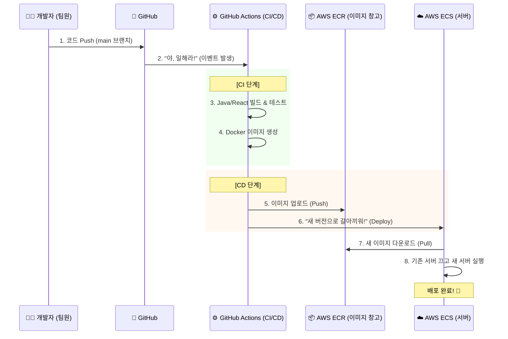

# 📘 SafeGuard 프로젝트 구조 및 배포 원리

팀원 여러분, 환영합니다! 👋
이 문서는 우리 프로젝트가 **어떻게 구성되어 있고(Architecture)**, **어떻게 배포되는지(CI/CD)** 한눈에 이해할 수 있도록 정리한 문서입니다.

---

## 1. 전체 시스템 구조 (Architecture)

우리 서비스는 **AWS 클라우드** 위에 올라가 있으며, 크게 3개의 컨테이너와 1개의 데이터베이스로 구성됩니다.

```mermaid
graph TD
    User((사용자))
    
    subgraph "AWS Cloud (Fargate)"
        ALB[로드 밸런서 / 공인 IP]
        
        subgraph "ECS Task (하나의 묶음)"
            Frontend[🖥️ Frontend\n(React + Nginx)]
            Backend[⚙️ Backend\n(Spring Boot)]
            AI[🤖 AI Service\n(FastAPI + YOLO)]
        end
        
        RDS[(🛢️ DB\nPostgreSQL)]
    end

    User -->|접속| ALB
    ALB -->|80| Frontend
    Frontend -->|API 호출| AI
    Frontend -->|API 호출| Backend
    Backend -->|데이터 저장/조회| RDS
```

### 핵심 포인트
1.  **ECS Fargate**: 우리 서버는 "가상 컴퓨터(EC2)"가 아니라 **"컨테이너(Fargate)"** 로 뜹니다. 서버 관리가 필요 없습니다.
2.  **RDS**: 데이터베이스는 컨테이너 안에 있지 않고, 안전한 **AWS RDS**에 따로 저장됩니다. (서버가 죽어도 데이터는 안전!)
3.  **Nginx**: 프론트엔드 안에 있는 Nginx가 사용자의 요청을 받아서 보여줍니다.

---

## 2. 배포 자동화 (CI/CD Pipeline)

우리는 **"버튼 하나로 배포"** 되는 자동화 시스템을 갖추고 있습니다.



### 팀원이 할 일
*   그저 **`main` 브랜치에 코드를 합치기(Merge)** 만 하면 됩니다.
*   나머지 2번부터 8번까지의 복잡한 과정은 **GitHub과 AWS가 알아서 처리**합니다.

---

## 3. 개발 환경 (Local vs Production)

| 구분 | 로컬 개발 (내 컴퓨터) | 실서버 (AWS) |
| :--- | :--- | :--- |
| **실행 명령어** | `docker-compose up` | (자동 배포됨) |
| **데이터베이스** | Docker 컨테이너 (가짜 DB) | **AWS RDS (진짜 DB)** |
| **접속 주소** | `localhost:80` | `http://3.34...` (공인 IP) |

*   **Tip**: 로컬에서도 실제 RDS 데이터를 보고 싶다면 `.env.example` 파일을 참고하세요!
