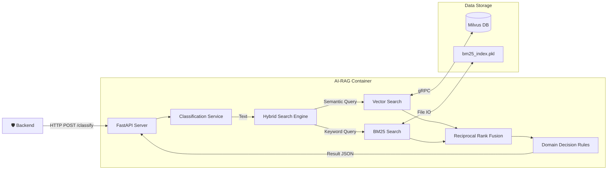
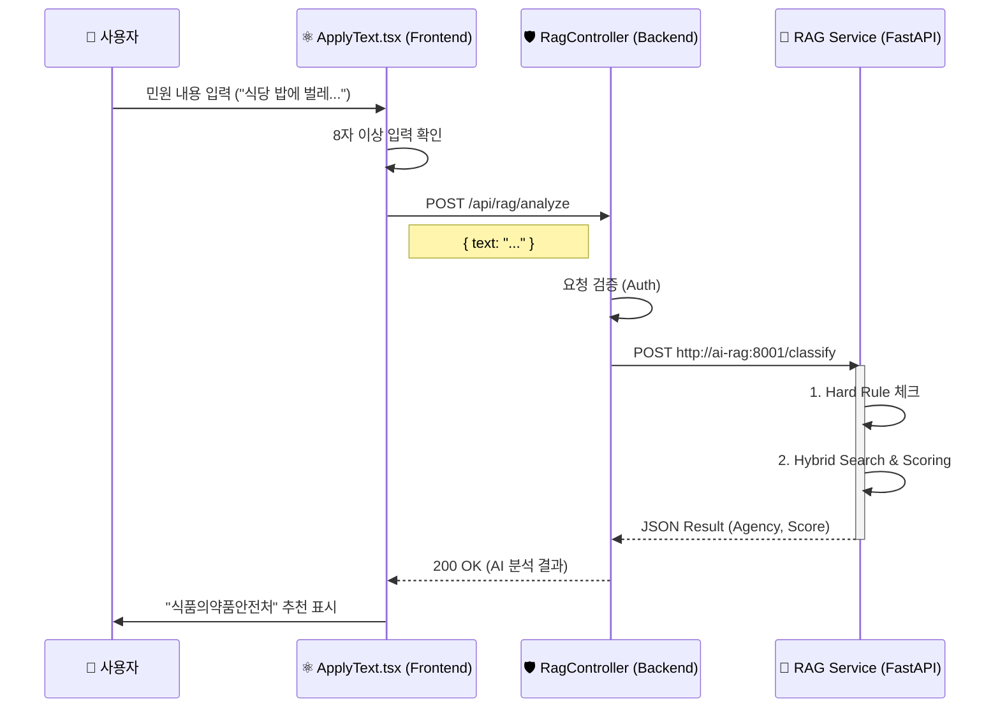
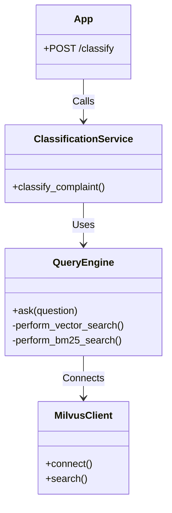

# SafeGuard RAG Guide

## 1. 개요 (Overview)
RAG 서비스는 사용자의 민원 텍스트를 분석하여 적절한 담당 행정 기관을 분류하는 핵심 AI 모듈입니다.
법령 데이터베이스(Vector DB)를 기반으로 한 하이브리드 검색과 규칙 기반 분류 로직을 결합하여 높은 정확도를 제공합니다.
Docker 컨테이너 환경(`safeguard-ai-rag`)에서 실행되며, FastAPI를 통해 외부 시스템과 통신합니다.

### 1.1 비즈니스 컨텍스트 (Business Context)
- **비즈니스 목적**: 민원 처리의 첫 단추인 '부서 배정'을 자동화하여 공무원의 행정 비용을 절감하고, 민원 처리 속도를 획기적으로 개선합니다.
- **사용자 가치**: 민원인은 복잡한 부서 찾기 없이 내용을 적기만 하면 되며(UX 개선), 담당 공무원은 오배정 민원 이송 업무에서 해방됩니다.

### 1.2 문제 정의 (Problem Statement)
- **배경**: 기존에는 민원인이 직접 카테고리를 선택해야 했으며, 잘못 선택 시 담당 공무원이 수동으로 재분류해야 하는 비효율이 존재했습니다.
- **상세**: 특히 '도로'와 '건설', '환경'과 '위생' 등 경계가 모호한 민원의 오분류율이 높았습니다.

### 1.4 전체 흐름도 (Overall Flow)
RAG 서비스가 외부 시스템(Backend) 및 내부 데이터 저장소(Milvus)와 상호작용하는 전체 흐름입니다.



### 1.5 프론트엔드 연동 구조 (Frontend Integration)
사용자가 텍스트 민원을 작성할 때, 프론트엔드(React)에서 백엔드를 거쳐 RAG 서비스로 이어지는 호출 흐름입니다.




## 1.1. 기술 스택 (Technical Stack)

| 구분 | 기술 / 라이브러리 | 용도 |
| :--- | :--- | :--- |
| **Language** | Python 3.9 | AI 서비스 메인 언어 |
| **Framework** | FastAPI | 고성능 API 서버 구축 |
| **Vector DB** | Milvus 2.3 | 법령 데이터 벡터 저장소 |
| **Search (Hybrid)** | SentenceTransformers, Rank_BM25 | 의미 검색(Semantic) + 키워드 검색(Lexical) |
| **NLP** | Kiwipiepy | 한국어 형태소 분석기 |
| **Infra** | Docker, MinIO, Etcd | 컨테이너 및 데이터 스토리지 구성 |

---

## 2. 파일 구조 및 역할 (File Structure and Roles)
각 파일의 역할과 내부 핵심 기능을 상세히 기술합니다.

### 2.0 연동 구조 (Implementation Structure)
각 파이썬 모듈이 어떻게 유기적으로 연결되어 동작하는지 보여주는 클래스/모듈 다이어그램입니다.




### 2.1. `app.py`
**역할**: RAG 서비스의 엔트리포인트이자 API 서버입니다. FastAPI 프레임워크를 기반으로 HTTP 요청을 처리합니다.

- **주요 엔드포인트**:
  - `POST /classify`: 민원 텍스트를 입력받아 최종 기관 분류 결과를 반환합니다. `classification_service.py`의 로직을 호출합니다.
  - `GET /health`: 서버의 상태(Health Check)를 반환합니다.
- **주요 기능**:
  - 서버 시작 시(`startup_event`) `milvus_client`를 통해 데이터베이스 연결을 초기화합니다.
  - CORS 설정을 통해 프론트엔드 등 외부 도메인에서의 접근을 허용합니다.
  - Pydantic 모델(`ComplaintInput`)을 사용하여 입력 데이터의 유효성을 검사합니다.

### 2.2. `classification_service.py`
**역할**: 검색 엔진에서 가져온 법령 데이터와 사용자 입력을 종합하여 최종 '행정 기관'을 결정하는 도메인 로직 계층입니다.

- **핵심 함수**: `classify_complaint(user_query)`
- **분류 알고리즘 (Logic Flow)**:
  1.  **전처리 (Preprocessing)**: 입력 텍스트의 공백을 제거하여 정규화합니다.
  2.  **강제 규칙 (Hard Rules)**:
      - "불법 주정차", "주정차 위반", "불법 주차/정차" 등 명확한 패턴이 발견되면 복잡한 검색 과정을 생략하고 즉시 '경찰청'으로 분류합니다.
      - 키워드 매칭은 `주차/정차/주정차` + `불법/단속/신고/위반` 조합을 모두 포괄하도록 설계되었습니다.
  3.  **검색 (Retrieval)**: `query.py`의 `ask()` 함수를 호출하여 관련 법령 문서를 가져옵니다.
  4.  **점수 산정 (Scoring)**:
      - 검색된 법령 파일명과 본문에 포함된 키워드를 분석하여 기관별 점수를 매깁니다.
      - 범용 법령(지방자치법 등)은 가중치를 낮추어 특정 기관으로 쏠리는 현상을 방지합니다 (Penalty Logic).
      - 사용자 질문에 포함된 키워드와 일치하는 기관에는 가중치를 더 부여합니다 (Bonus Logic).
  5.  **최종 결정 (Decision)**: 가장 높은 점수를 획득한 기관을 선정하고, 신뢰도(Confidence)와 판단 근거(Reasoning)를 생성합니다.

### 2.3. `query.py`
**역할**: 사용자의 질문에 대해 실제 데이터베이스 검색을 수행하는 검색 엔진 모듈입니다.

- **핵심 함수**: `ask(question, top_k)`
- **검색 전략 (Hybrid Search)**:
  - **Vector Search (`perform_vector_search`)**:
    - `SentenceTransformer` 모델을 사용하여 질문을 384차원 벡터로 변환합니다.
    - Milvus DB에서 코사인 유사도(Cosine Similarity)가 높은 문서를 찾습니다. (의미 기반 검색)
  - **Keyword Search (`perform_bm25_search`)**:
    - `Kiwipiepy` 형태소 분석기를 사용하여 질문을 토큰화합니다.
    - 사전에 생성된 `BM25` 인덱스를 통해 키워드 매칭 점수가 높은 문서를 찾습니다. (단어 기반 검색)
  - **RRF (Reciprocal Rank Fusion)**:
    - 위 두 가지 검색 결과를 `1 / (k + rank)` 공식을 사용하여 하나의 순위로 통합합니다.
    - 이를 통해 의미적 유사성과 키워드 정확도를 모두 고려한 최적의 문서를 반환합니다.


### 2.5. `ingest.py`
**역할**: PDF 형태의 법령 데이터를 읽어 벡터 데이터베이스(Milvus)에 적재하는 데이터 파이프라인 스크립트입니다.

- **실행 시점**: 시스템 초기 구축 시 또는 법령 데이터가 업데이트되었을 때 1회 실행합니다.
- **처리 과정 (Pipeline)**:
  1.  **Text Extraction**: `pdfplumber`를 사용하여 PDF 파일에서 텍스트를 추출합니다.
  2.  **Chunking**: 긴 텍스트를 500자 단위로 자르고, 100자씩 겹치게(Overlap) 하여 문맥이 끊기지 않도록 합니다.
  3.  **Embedding**: `SentenceTransformer` 모델을 사용하여 각 청크를 벡터로 변환합니다.
  4.  **Indexing**: BM25 검색을 위한 역색인(Inverted Index)을 생성하여 로컬 파일(`bm25_index.pkl`)로 저장합니다.
  5.  **Storage**: 벡터 데이터와 메타데이터를 Milvus DB에 Insert 합니다.

### 2.6. `milvus_client.py`
**역할**: Milvus 데이터베이스와의 연결, 컬렉션 생성, 인덱스 관리를 전담하는 모듈입니다.

- **주요 기능**:
  - `connect_milvus()`: Docker 네트워크상의 Milvus 서버에 접속합니다.
  - `create_collection()`: 데이터 스키마(ID, Embedding, Text, Source)를 정의하고 컬렉션을 생성합니다.
  - `get_collection()`: 다른 모듈(ingest, query)에서 컬렉션 객체를 요청할 때 안전하게 반환합니다.

### 2.7. `logging_config.py`
**역할**: 애플리케이션의 로그 포맷을 JSON 형태로 표준화하여 컨테이너 환경에서의 로그 수집 및 분석을 돕습니다.
- **주요 기능**: `setup_logging()` 함수를 통해 루트 로거를 초기화하고 `python-json-logger`를 적용합니다.

### 2.8. `Dockerfile` & `requirements.txt`
**역할**: RAG 서비스의 실행 환경을 정의합니다.
- **Dockerfile**: Python 3.9-slim 기반 이미지, PyTorch(CPU), 필수 의존성 설치 및 8001번 포트 노출.
- **requirements.txt**: `fastapi`, `pymilvus`, `sentence-transformers`, `kiwipiepy` 등 핵심 라이브러리 목록 명시.

### 2.9. `rag_data/` (Directory)
**역할**: RAG 시스템의 초기 데이터 소스 및 로컬 인덱스 저장소입니다.
- **내용물**:
    - `*.pdf`: 분석 대상이 되는 법령 PDF 원본 파일들.
    - `bm25_index.pkl`: `ingest.py` 실행 시 생성되는 BM25 키워드 인덱스 파일.

### 2.10 데이터 구조 및 인프라 (Data Structure & Infrastructure)

#### 3가지 핵심 데이터 저장소 (The 3 Pillars of Data)
`ingest.py` 실행 시 생성되는 RAG 시스템의 3가지 데이터 형태입니다.

1. **Milvus Vector DB (의미 저장소)**
    - **역할**: AI가 이해하는 의미(Vector)를 저장. 유사 의미 검색 담당.
    - **핵심 필드**: `embedding` (384 dim), `text` (법령 원문), `source` (파일명).
2. **BM25 Index (키워드 저장소)**
    - **역할**: 단어 출현 빈도 통계. 정확한 용어 매칭 담당.
    - **파일**: `bm25_index.pkl` (Local Storage).
3. **Raw Source Files (원본 저장소)**
    - **역할**: 데이터의 원천(Source of Truth). 분석 대상 PDF 파일.

#### Milvus 인프라 구성 (Infrastructure Components)
Docker로 실행되는 Milvus 시스템의 내부 구조입니다.

| 컴포넌트 | 역할 | 기능 |
| :--- | :--- | :--- |
| **Milvus Standalone** | Coordinator | 벡터 연산, 쿼리 처리, 시스템 조정 |
| **Etcd** | Meta Storage | 데이터 스키마, 노드 상태 등 메타데이터 관리 |
| **MinIO** | Object Storage | 실제 벡터 데이터 및 로그 파일의 영구 저장(Persistence) |

---

## 3. 핵심 기술 및 알고리즘 (Core Technology and Algorithms)
RAG 서비스의 정확도를 보장하는 핵심 기술적 요소들입니다.

### 3.1 하이브리드 검색 (Hybrid Search)
의미적 유사성과 키워드 일치를 동시에 고려하여 검색 품질을 극대화합니다.
- **Vector Search (Semantic)**: `SentenceTransformers`로 텍스트를 임베딩하여 문맥적 의미가 유사한 문서를 찾습니다. (예: "식당 위생" ↔ "식품위생법")
- **BM25 Search (Lexical)**: `Kiwi` 형태소 분석을 통해 정확한 단어 매칭을 수행합니다. (예: "신고"라는 구체적 단어 포함 여부)

### 3.2 RRF (Reciprocal Rank Fusion)
두 가지 검색 결과(Vector, BM25)를 공정하게 통합하는 랭킹 알고리즘입니다.
- **수식**: $Score(d) = \sum \frac{1}{k + rank(d)}$
- 어느 한쪽 검색 엔진에서만 상위에 랭크되어도, 두 엔진 모두에서 애매한 순위인 것보다 높은 점수를 받도록 설계되었습니다.

### 3.3 도메인 보정 점수 (Domain Scoring)
- **Query Hint**: 사용자 입력에서 "불법주차", "소음" 등 특정 부서를 강력하게 암시하는 단어가 발견되면 기본 점수(**`+5.0`**)를 부여합니다. 이 보너스는 검색 결과의 미세한 점수 차이를 압도하여 정확도를 보장합니다.
- **Noise Filtering**: `MIN_VECTOR_SCORE_THRESHOLD = 0.63`을 적용하여, 유사도가 너무 낮은(노이즈) 벡터 검색 결과가 분류 점수에 영향을 미치지 않도록 차단합니다.
- **Keyword Match**: 분류된 기관의 핵심 업무 키워드가 포함되면 추가 가산점을 부여합니다.

---

## 4. 환각 및 오인식 차단 매커니즘 (Hallucination & Misclassification Prevention)
LLM 및 검색 기반 AI의 고질적인 문제인 환각(Hallucination)과 오분류를 방지하기 위한 안전장치입니다.

### 4.1 MOIS Guard (행정안전부 쏠림 방지)
- **문제**: "민원 처리에 관한 법률" 등 행정안전부 소관의 법령은 거의 모든 민원과 키워드가 겹칩니다. 이로 인해 모호한 민원이 모두 행안부로 쏠리는 현상이 발생합니다.
- **해결**: 사용자 입력에 행안부 고유 업무(예: "주민등록", "등본") 관련 키워드가 없다면, 행안부의 최대 점수를 강제로 제한(`Constraint`)하여 오분류를 차단합니다.

### 4.2 Broad Law Penalty (범용 법령 페널티)
- **원리**: 변별력이 낮은 범용 법령(지방자치법, 행정절차법 등)이 검색 결과 상위에 오를 경우, 해당 점수에 `0.35`를 곱하여 영향력을 대폭 축소합니다.
- **효과**: "법"이라는 단어 때문에 엉뚱한 부서로 배정되는 것을 막습니다.

### 4.3 Confidence Threshold (신뢰도 임계값)
- **Hard Threshold**: 최종 산출된 신뢰도 점수가 `0.45` 미만이면 결과를 버리고 **'기타(수동 분류)'**로 처리합니다.
- **Soft Margin**: 1순위와 2순위 기관의 점수 차이가 `0.4` 미만인 '박빙' 상황에서도 위험을 감수하지 않고 '기타'로 돌려 안전성을 확보합니다.

---

## 5. 스트림 처리 및 분류구조 (Classification Structure & Pipeline)
RAG 서비스는 스트림(Stream) 방식이 아닌 HTTP 요청/응답 기반의 파이프라인 구조로 동작하지만, 내부적으로는 데이터가 흐르듯 단계별로 처리됩니다.

### 5.1 분류 파이프라인 (Sequential Pipeline)
```mermaid
flowchart TD
    Start([User Input]) --> Preprocess[텍스트 전처리/정규화]
    Preprocess --> HardRule{특정 키워드 발견?}
    
    HardRule -- Yes (불법주차/정차 단속 등) --> Instant[즉시 분류 (Hard Rule)]
    HardRule -- No --> Search[Hybrid Search 실행]
    
    subgraph "Retrieval & fusion"
        Search --> Vec[Vector Search (Milvus)]
        Search --> Key[BM25 Search (Kiwi)]
        Vec & Key --> RRF[RRF 랭킹 융합]
    end
    
    RRF --> Scoring[기본 점수 산정]
    
    subgraph "Safety Mechanisms"
        Scoring --> Noise[Noise Filter]
        Noise --> Bonus[Keyword Bonus]
        Bonus --> Penalty[Broad Law Penalty]
        Penalty --> Mois[MOIS Guard]
    end
    
    Mois --> Threshold{Confidence Check}
    
    Threshold -- Low Confidence --> Unknown[기분류 '기타']
    Threshold -- High Confidence --> Success[최종 기관 선정]
    
    Instant --> Result([JSON Result])
    Unknown --> Result
    Success --> Result
```

### 5.2 계층적 분류 구조
단순히 기관만 분류하는 것이 아니라, 대-중-소 카테고리를 계층적으로 추론합니다.
- **Agency (기관)**: 국토교통부, 경찰청 등 (물리적 처리를 담당하는 주체)
- **Category (분류)**: 교통, 보건, 시설 등 (민원의 성격)
- **Keywords (근거)**: 판단의 근거가 된 핵심 단어들

---


## 6. API 명세 (API Specification)

### 6.1. 기관 분류 (`POST /classify`)
- **설명**: 사용자 텍스트 민원을 분석하여 담당 기관을 반환합니다.
- **Request Body**:
  ```json
  {
    "text": "도로에 싱크홀이 생겨서 위험합니다."
  }
  ```
- **Response**:
  ```json
  {
    "agency_code": 19,
    "agency_name": "국토교통부",
    "category": "교통",
    "confidence": 0.85,
    "reasoning": "관련 법령 및 키워드 분석 결과, '국토교통부' 소관으로 가장 높게 식별되었습니다.",
    "sources": ["도로법.pdf (VECTOR: 0.8250)", "시설물안전법.pdf (BM25: 1.4500)"],
    "message": "Success"
  }
  ```


---

## 7. 설치 및 실행 가이드 (Installation & Run Guide)

### 7.1. 서비스 실행 (Docker)
```bash
# 전체 서비스 빌드 및 실행
docker-compose up -d --build

# 실행 상태 확인
docker ps | grep ai-rag
```
- API 서버 포트: **8001**
- Swagger 문서: `http://localhost:8001/docs`

### 7.2. 법령 데이터 적재 (Data Ingestion)
```bash
# RAG 컨테이너 내부에서 적재 스크립트 실행 (최초 1회)
docker exec -it safeguard-ai-rag python ingest.py
```

---

## 8. 요구사항 정의 (Requirements)

### 8.1 기능 요구사항 (Functional)
| ID | 요구사항 | 설명 | 중요도 |
| :-- | :--- | :--- | :--- |
| FR-1 | **자동 분류** | 텍스트 입력 시 1초 이내에 담당 기관/부서를 추천해야 한다. | Must |
| FR-2 | **법령 근거 제공** | 분류 결과와 함께 판단 근거가 되는 관련 법령명을 제시해야 한다. | Must |

| FR-4 | **오분류 방지** | 신뢰도가 낮거나(0.45 미만) 경합 상황일 경우 '기타'로 분류하여 수동 처리를 유도해야 한다. | Should |

### 8.2 비기능 요구사항 (Non-Functional)
- **성능**: 단일 요청 처리 시간(Latency) **2초 이내** (Milvus 검색 포함).
- **가용성**: AI 서비스 컨테이너가 중단되더라도 재시작 정책(`restart: unless-stopped`)에 의해 자동 복구되어야 한다.

---

## 9. 예외 및 오류 처리 (Exception & Error Handling)

### 9.1 주요 오류 시나리오
- **Milvus 연결 실패**: RAG 검색 불가 시, 로그(`logger.error`)를 남기고 '기타'로 Fallback 처리 (System availability 우선).
- **검색 결과 없음**: 법령 매칭이 안 될 경우 `confidence: 0.0`으로 응답하며, 프론트엔드에서는 "분류 불가" 메시지를 표시하지 않고 담당자 확인 필요 상태로 처리.

---

## 10. 품질 및 정확도 신뢰도 관리 (Quality & Accuracy Management)

### 10.1 품질 보증 로직
- **Hybrid Search**: 단순 키워드 매칭(BM25)의 한계를 벡터 검색으로 보완.
- **MOIS Guard**: '행정안전부' 관련 키워드(등본, 전입 등)가 없는데도 범용 법령 때문에 행안부로 분류되는 것을 방지하는 **Penalty Logic** 적용 (`classification_service.py`).
- **Threshold**: Top1, Top2 기관 점수 차이가 0.4 미만일 경우 과감하게 보류('기타') 처리하여 오분류 리스크 최소화.

### 10.2 테스트 전략 (Test Strategy)
- **Unit Test**: 규칙 및 점수 산정 로직 단위 테스트.
- **Integration Test**: 데이터 적재 및 검색 엔진 연동 테스트.
- **Manual Test**: Swagger를 통한 다양한 케이스 검증.

---

## 11. 보안 설계 (Security Design)

- **Network Isolation**: `safeguard-network` 내부에서만 통신하며, 외부(Host)에는 API 포트(8001)만 노출.
- **No Sensitive Data**: RAG가 사용하는 데이터는 공개된 '법령' 데이터이므로 개인정보 이슈가 없음. 민원 텍스트는 저장하지 않고 휘발성으로 처리.

---

## 12. 운영 및 모니터링 (Operations & Monitoring)

### 12.1 모니터링 지표 (Prometheus)
- **`http_requests_total`**: 분류 요청 트래픽량 감시.
- **`http_request_duration_seconds`**: RAG 추론(검색) 속도 모니터링. P99 지연 시간 3초 초과 시 알림 필요.

### 12.2 장애 대응
- **서비스 다운 시**: Docker Compose Healthcheck를 통해 자동 재시작.
- **지속적 오분류 발견 시**: `KEYWORD_TO_AGENCY` 매핑 테이블 업데이트 또는 `BROAD_LAWS` 리스트 튜닝 후 재배포.


### 12.3 RAG 시스템 신뢰도(Confidence) 산출 가이드 (Reliability Guide)

이 섹션은 민원 분류 결과의 **신뢰도(Confidence)**가 어떻게 계산되고 활용되는지 상세히 설명합니다.

#### A. 신뢰도 산출 공식
신뢰도는 검색된 결과들의 점수 합산 중 최종 선택된 기관이 차지하는 비율을 기반으로 계산됩니다.

- **수식**: $Confidence = \frac{Best\_Agency\_Score}{Total\_Agency\_Score}$
- **정규화**: 산출된 값은 소수점 둘째 자리까지 반올림하여 반환합니다 (범위: 0.0 ~ 1.0).
- **계산 위치**: `classification_service.py`의 `_decide_with_fallback_to_other_or_etc` 함수

#### B. 점수(Score) 구성 요소
최종 신뢰도를 결정하는 각 기관의 점수는 다음과 같은 요소들의 합으로 이루어집니다.

| 요소 | 가중치 | 설명 |
| :--- | :--- | :--- |
| **질의어 힌트** | +5.0 | 질의어에 특정 키워드(예: '불법주차', '재난')가 포함된 경우 부여 |
| **벡터 검색** | 1.0 + 유사도 | 의미적 유사성 (Cosine Similarity, 0.63 미만은 무시) |
| **키워드 검색** | 1.0 + BM25/10 | 형태소 분석 기반 키워드 매칭 점수 |
| **파일명 매칭** | +0.5 | 검색된 법령 파일명에 해당 기관명이 포함된 경우 보너스 |
| **힌트 일치** | +1.0 | 검색 결과 파일과 질의어 힌트 기관이 일치할 경우 부여 |
| **범용 법령** | × 0.35 | '지방자치법' 등 변별력이 낮은 법령은 결과 왜곡 방지를 위해 감점 |

#### C. 페널티 및 보정 로직
1.  **Broad Law Penalty**: 모든 분야에 걸쳐있는 범용 법령은 점수에 **0.35**를 곱하여 특정 기관으로의 쏠림을 방지합니다.
2.  **MOIS Guard (행안부 게이트)**: '재난', '민원' 등 특정 문맥 키워드가 없는 경우 행정안전부의 점수 비중을 상한선(0.8) 이하로 제한합니다.

#### D. 신뢰도 기반 필터링 및 안전장치
시스템은 오분류 리스크를 줄이기 위해 다음과 같은 하한선을 적용합니다.
- **Confidence Floor (0.45)**: 최종 신뢰도가 45% 미만이면 '기타'로 분류합니다.
- **Gap Analysis (0.40)**: 1순위와 2순위 기관의 점수 차이가 0.4점 미만이면 판단을 유보하고 '기타'로 분류합니다.
- **Hard Rule (1.0)**: 불법주정차 등 명확한 규칙에 의한 분류는 검색을 생략하고 100% 신뢰도를 부여합니다.

---

## 13. 신뢰도 검증 시나리오 및 예시 (Verification Examples)

### 13.1 점수 산정 상세 시나리오
내부 엔진이 최종적으로 내놓는 점수에 대한 3가지 시나리오 분석입니다.

**시나리오 1: "공원 운동기구가 부러져서 사용이 불가능합니다."**
1.  **질의 힌트 (+5.0)**: `운동기구` 키워드가 '국토교통부'로 인식됨.
2.  **검색 결과 (+1.5)**: `도시공원 및 녹지 등에 관한 법률.pdf`가 높은 유사도로 검색됨.
3.  **최종 결정**: 힌트(5.0) + 검색(1.5) = **6.5점**. 신뢰도 0.85 이상으로 '국토교통부' 확정.

**시나리오 2: "재난 문자가 너무 자주 와서 일에 방해가 돼요."**
1.  **질의 힌트 (+5.0)**: `재난` 키워드가 '행정안전부' 보너스 획득.
2.  **보정 해제**: `재난` 단어가 문맥 확인 리스트에 있어 점수 상한 제한 해제.
3.  **최종 결정**: 힌트(5.0) + 검색(2.0) = **7.0점**. '행정안전부' 확정.

**시나리오 3: "우리 동네 가로등이 밤에 너무 어두워서 무서워요."**
1.  **질의 힌트 (+5.0)**: `어두워` 키워드가 '국토교통부' 힌트 매칭.
2.  **검색 결과 (+1.2)**: `도로법.pdf` (벡터 유사도 기반 검색).
3.  **최종 결정**: 힌트(5.0) + 검색(1.2) = **6.2점**. '국토교통부' 분류.

### 13.2 실제 검증 예시 및 JSON 응답

**[예시 1] 식품위생 관련 민원**
- **질문**: "어제 식당에서 먹은 밥에서 파리가 나왔어요. 위생 상태가 너무 엉망인데 어디에 신고해야 하나요?"
- **결과**: 식품의약품안전처 | **신뢰도: 0.93**
- **JSON**:
  ```json
  {
    "agency_code": 23,
    "agency_name": "식품의약품안전처",
    "category": "보건",
    "confidence": 0.93,
    "reasoning": "유사 민원 사례 분석 결과, '식품의약품안전처' 소관 업무로 판단됩니다.",
    "sources": ["식품위생법.pdf (VECTOR: 0.8420)", "유사 민원 사례집.md (BM25: 1.2500)"]
  }
  ```

**[예시 2] 불법주정차 (Hard Rule)**
- **질문**: "아파트 앞 도로에 불법 주정차된 차들 때문에 너무 불편합니다. 단속 좀 해주세요."
- **결과**: 경찰청 | **신뢰도: 1.0**
- **JSON**:
  ```json
  {
    "agency_code": 18,
    "agency_name": "경찰청",
    "category": "경찰·검찰",
    "confidence": 1.0,
    "reasoning": "불법 주정차 민원은 경찰청/지자체 단속 사항으로 즉시 분류됩니다.",
    "sources": [],
    "message": "Success"
  }
  ```

**[예시 3] 행정 무관/모호한 민원**
- **질문**: "오늘 기분이 너무 안 좋아서 그런데 누구랑 얘기 좀 하고 싶어요."
- **결과**: 기타 | **신뢰도: 0.0**
- **JSON**:
  ```json
  {
    "agency_code": 38,
    "agency_name": "기타",
    "category": "기타",
    "confidence": 0.0,
    "reasoning": "관련 법령 검색 결과가 없습니다.",
    "sources": []
  }
  ```
